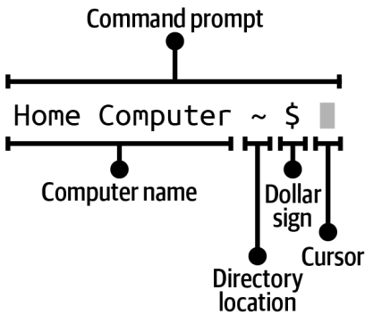
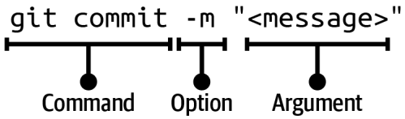

# Git

## Definitions

- **Git**: a technology for tracking changes to a project and enabling collaboration on it (**version control system**)

- **CLI**: Command Line Interface (aka shell, terminal), a way to interact with computer by entering and executing commands instead of using GUI (Graphical User Interface)

- **Repository (Repo)**: a project version controlled by Git, **Local repo** is stored on your computer and **Remote repo** is hosted on a hosting service.

- **Commit**: a version of your project (snapshot),

- **Commit ID**: a unique 40-character hash that you only need its first 7 characters to refer to that commit

#### The Areas of Git

1. **Working directory**: contains the files and dirs in the project directory that represent one version of a project, where you make all the modifications to the content of your project

2. **Staging area**: a rough draft space, represented by a file called **index** in _.git_ (a binary file, created only if you have added at least one file to the staging area)

3. **Commit history**: where your commits are saved, represented by the **objects** dir inside _.git_

- **Untracked file**: a file in the working directory that Git is not version controlling, once you add this file to staging area and include it in a commit, it became a **tracked file**

## CLI Commands

```bash
whoami  # print computer username

echo <what_you_want_to_print>  # print the input

pwd  # print working directory

ls  # list **visible** files and dirs

ls -a  # list **hidden & visible** file and dirs

ls -la  # list **hidden & visible** file and dirs with their permissions

cd <path_to_dir>  # change dir

mkdir <dir_name>  # make a new dir

clear  # clear the CLI from previous commands

exit  # close the terminal window
```

## Git Commands

```bash
git status
# Show the state of the working directory and the staging area (list all modified files)

git add <filename>
# Copy one file from working dir to the staging area

git add <filename> <filename> ...
# Add multiple files to the staging area

git add -A
# Add all the files in the working directory that have been edited or changed to the staging area

git commit -m “<message>”
# Create a new commit with a csommit message, changes became tracked

git log
# Show a list of commits which are reachable by following the parent links from the commit you are on when you execute the command in reverse chronological order, exit with pressing 'q'

git log --all
# Show a list of commits in reverse chronological order for all branches in a local repository

git cat-file -p <commit_hash> # check the parent of the given commit

git branch
# List local branches

git branch <new_branch_name>
# Create a branch, branch name can't contain spaces

git switch <branch_name>
# Switch branches, not available in git older than version 2.23

git checkout <branch_name>
# Switch branches

git merge <branch_name>
# Integrate changes from one branch into another branch

git checkout <commit_hash>
# Check out a commit

git switch -c <new_branch_name>
# Create a new branch and switch onto it

git checkout -b <new_branch_name>
# Create a new branch and switch onto it

git remote add <connection_name> <URL>
# Add a connection to a remote repository named <connection_name> at <URL>, connection_name == shortname

git remote
# List the remote repository connections stored in the local repository by shortname

git remote -v
# List the remote repository connections in the local repository with shortnames and URLs

git push <shortname> <branch_name>
# Upload content from <branch_name> to the <shortname> remote repository

git branch --all
# List local branches and remote-tracking branches

git clone <URL> <directory_name>
# Clone a remote repository

git push <shortname> -d <branch_name>
# Delete a remote branch and the associated remote-tracking branch

git branch -d <branch_name>
# Delete a local branch

git branch -vv
# List the local branches and their upstream branches, if they have any

git fetch <shortname>
# Download data from the <shortname> remote repository

git fetch
# Download data from the remote repository with shortname origin

git fetch -p
# Remove remote-tracking branches that correspond to deleted remote branches and download data from the remote repository

git branch -u <shortname>/<branch_name>

or

git branch --set-upstream-to <shortname>/<branch_name>
# Define an upstream branch for the current local branch

git pull <shortname> <branch_name>
# Fetch and integrate changes from the <shortname> remote repository for the specified <branch_name>

git pull
# If an upstream branch is defined for the current branch, fetch and integrate changes from the defined upstream branch,git fetch + git merge/git rebase

git merge --abort
# Stop the merge process and go back to the state before the merge

git rebase <branch_name>
# Reapply commits on top of another branch

git rebase --continue
# Continue with the rebase process after having resolved merge conflicts

git rebase --abort
# Stop the rebase process and go back to the state before the rebase

git restore --staged <filename>
# Restore a file to another version of the file in the staging area, use below command for unstage a file in git version older than 2.23:
git reset HEAD <filename>

git switch -c topic
# Creating a branch and switching onto it in one go

git pull -p
# Pulling new changes and delete any remote-tracking branches to remote branches that have been deleted in the remote repository
```

## Actions

### 1. Setting up the Git

- After installing the Git on your computer, you must add your name and email in its config.

```bash
git config --global user.name "<name>" # Set your name in the global Git configuration file
```

```bash
git config --global user.email "<email>" # Set your email address in the global Git configuration file
```

```bash
git config --global --list # List the variables in the global Git configuration file and their values
```

### 2. Initializing a Local Repo

- By initializing (creating) a repo, a hidden dir **.git** will be created that contains all the data on file changes

```bash
git init # Initialize a Git repo with default 'master' branch
```

```bash
git init -b <branch_name> # Initialize a Git repo and set the name for the initial branch to be <branch_name>
```

```bash
git config --global init.defaultBranch "<branch_name>" # Set default branch name in Git config
```

### 3. Working in Staging Area

**commit early, commit often**

- Commit steps:

1. add files to the staging area
2. make a commit with a commit message

- git log shows below info about each commit:

1. commit hash
2. author name and email address
3. data and time commit was made
4. commit message

- Why to use Branches?

1. to work on the same project in different ways

2. to help multiple people work on the same project at the same time

official primary branch: main
secondary branch: topic/feature branches

- Branch: movable pointers to commits

- in .git/refs/heads s file is stored for each local branch.

- Tracked files in the working directory can be in one of two states:

1. Unmodified files that have not been edited since the last commit.

2. Modified files has been edited (and saved in the text editor)

Every commit, other than the very first one in a repository, has a parent commit.

- HEAD: a pointer that tells you which branch you are on (the version you are looking at)

- heads directory (.git/refs/heads) stores a file for every local branch in your local repo, while HEAD shows which branch you are on by referencing one of the files inside the heads directory

- git switch (checkout):

1. It changes the HEAD pointer to point to the branch you are switching onto.

2. It populates the staging area with a snapshot of the commit you are switching onto.

3. It copies the contents of the staging area into the working directory.

- Merging: integrate the changes made in one branch into another branch

- source branch: contain changes
- target branch: receives changes

\*\* A branch’s development history can be traced by following the parent links
of commits.

- Fast-forward merge: a type of merge that occurs when the development histories of the branches involved in the merge have not diverged—in other words, when it is possible to reach the target branch by following the parent links that make up the commit history of the source branch.

During a fast-forward merge,
Git takes the pointer of the target branch and moves it to the commit of the source branch.

If we can reach one branch through the commit history of another branch, we say that the development histories of the branches have not diverged.

- Three-way merge: a type of merge that occurs when the development histories of the branches involved in the merge have diverged.
  Development histories have diverged when it is not possible to reach the target branch by following the commit history of the source branch. In this case when you merge the source branch into the target branch, Git performs a three-way merge, creating a merge commit to tie the two development histories together; it then moves the pointer of the target branch to the merge commit.

\*\* A merge commit is a commit that
has more than one parent.

- Merge Conflict: occurs in three-way merges, 2 branches have different changes to the same files

- Merging steps:

1. Switch onto the target branch

2. Use the git merge command and pass in the name of the source branch

\*\* switching branches changes the contents of your working directory

Git will not prevent you from switching branches if you make changes to files without saving them in the text editor, because those files will be considered unmodified files.

- Detached HEAD state: when you checkout a commit and HEAD points to a commit not a branch, in this way you can lookout at any version of your project,
  It is not recommended to make any changes to a repository while in detached HEAD state

- Git hosting services: gitHub, GitLab, Bitbucket

To transfer data between a local repository and a remote repository on a hosting service, you must connect and authenticate using either SSH or HTTPS.

The HTTPS protocol uses a username and some sort of password (or authentication credential) to allow you to securely connect to remote repositories.

The SSH protocol uses a public and private SSH key pair to allow you to securely connect to remote repositories. The three main steps to setting up SSH access are:

1. Create an SSH key pair on your computer.
2. Add the private SSH key to the SSH agent.
3. Add the public SSH key to the hosting service account.

- Why you need remote repo?

• Easily back up your project somewhere other than your computer.

• Access a Git project from multiple computers.

• Collaborate with others on Git projects.

\*\* A local repository can have connections to multiple remote repositories, although this isn’t very common.

Once a connection to a remote repository is stored in a local repository, you are able to connect to the remote repository by referring to the shortname rather than the URL in the command line.

When you clone a remote repository to create a local repository, Git automatically adds a connection to the remote repository with the default shortname **origin**.

the connection between a local and a remote repository goes from the local repository to the remote repository but not the other way around

\*\* every remote branch has a remote-tracking branch, a reference in a local repository to the commit a remote branch pointed at the last time any
network communication happened with the remote repos like a bookmark.

You can set up a tracking relationship between a local branch and a remote branch by defining which remote branch a local branch should track. This is referred to as the upstream branch.
There are some cases where Git will set the upstream branch automatically, but in other cases you have to set it explicitly.

If the local branch has an upstream branch defined for it, you can
use git push with no arguments, and Git will automatically push the work to that branch.

After you execute the git push command, two things will happen:

1. A remote branch will be created in your remote repository.

2. A remote-tracking branch will be created in your local repository.

The git clone command does the following:

1. Create a project directory inside the current directory.

2. Create (initialize) the local repository.

3. Download all the data from the remote repository.

4. Add a connection to the remote repository that was cloned; by default it will have the shortname origin in the new local repository.

- When you clone a repository, Git needs to know which branch it should be on when it’s done cloning. The origin/HEAD pointer determines which branch this is.

when you clone a repository the git clone command will create remote-tracking branches for all the branches currently present in the remote repository that is being cloned, but the only local branch that is created is the branch that origin/HEAD points to.
you must switch to the remote-tracking branch then its local branch will be created.

At the time of cloning the remote repository URL was associated with a shortname in the local repository, and origin is the default shortname Git associates with a remote repository when you clone it.

When you delete a branch with commits that are not part of any other branch, you don’t delete the commits that are part of that branch. The commits still exist in your commit history.
However, they are no longer easy to reach, because there is no simple branch reference to them and they are not part of the development history of any existing branch.

\*\* You can also delete a remote branch directly on the website of a hosting service, but keep in mind that this will not delete the remote-tracking branch.

you cannot be on a branch when you delete it.

Recall that an upstream branch is the remote branch that a particular
local branch tracks. When you clone a repository, upstream branches are automatically set up for the branches that exist in the cloned repository.

- fetch: process of downloading data from a remote repo to a local repo

The git fetch command affects only remote-tracking branches. It does not affect local branches.

Merge conflicts arise when you merge
two branches where different changes have been made to the same parts in the same file(s), or if in one branch a file was deleted that was edited in the other branch.

Some people don’t like three-way merges because they find that merge commits make the commit history more complicated. To avoid three-way merges you may use the process of rebasing

upstream branches are automatically set up when you clone a repository,
but not when a repository is initialized locally

it is important to understand that if you add a file to the staging area and then make another change to the file, Git will interpret this as a new version of the file and it will mark the file as modified. Then, if you want the latest version of the file to be included in your next commit, you will have to add the updated version of the file to the staging area again.

working tree is clean: the state of the working directory and staging area are the same

Git, by default, uses a text editor in the command line called Vim to write commit messages.
If a commit is being made (whether a regular commit or a merge commit) and a commit message is not specified, Git will enter Vim in the command line.

Merge made by the 'ort' strategy == three-way merge

pull: process of fetching data from a remote repository and integrating it into a branch in a local repository in one go

• If the development histories of the local branch and remote branch in a git pull have not diverged, then by default a fast-forward merge will occur.

• If the development histories of the local branch and the remote branch in a git pull have diverged, then you must tell Git whether you want to integrate the changes by merging or rebasing (otherwise, you’ll get an error). To tell Git to integrate the changes by merging, you must pass in the --no-rebase option. To tell Git to integrate the changes by rebasing, you must pass in the --rebase option.

It is common for Git users to use the git pull command when the development histories of the local and remote branches have not diverged, and therefore a simple fast-forward merge
will happen. If the development histories of the local and remote branches have diverged, Git
users often prefer to use the git fetch command then choose whether to rebase or merge in a separate step. By carrying out the process in two steps, they give themselves more time to
look at what is going to change in their local branch and to prepare for the integration process.

There are two steps to resolving merge conflicts:

1. Decide what to keep, edit the content, and remove the conflict markers.
2. Add the file(s) you have edited to the staging area and commit your changes.

You can use the process of rebasing to avoid three-way merges and merge commits and maintain a linear project history.

Rebasing takes all the work you have done in the commits on one branch and reapplies the work on another branch, creating entirely new commits.

Given that rebasing creates entirely new commits, this means it changes the commit history.

Rebasing a branch does not delete the commits on that branch; it simply re-creates them. The old commits still exist in the commit history.

- Rebasing Process Stages

1. find the common ancestor

2. store info about the branches involved in the rebase: Git will save the changes introduced by each commit of the branch you’re on to a temporary area. It will also save additional information in this temporary area, such as which branch you’re rebasing onto and where it was pointing when you initiated the rebase.

3. reset HEAD to the same commit as the branch you are rebasing onto

4. apply and commit the changes

5. switch onto the rebased branch (point to the last commit)

Git will carry out the entire rebase process independently, unless it encounters merge conflicts. In this case, you must step in and resolve them. The process for resolving merge conflicts while rebasing is similar to the process when doing a three-way merge, with a few small differences.

When resolving merge conflicts in a three-way merge, all the merge conflicts are presented to you at the same time; once you’ve resolved all the conflicts and added all the updated files to the staging area, you make the final merge commit. By contrast, in the process of rebasing, as Git applies the changes from each commit one by one, it will pause the process if it encounters merge conflicts in any reapplied commit. This means that you may have to resolve merge conflicts several times when rebasing, depending on how many commits contain merge conflicts.

Once you’re done resolving the merge conflicts in a specific commit, you need to add the updated files to the staging area and then instruct Git to resume the rebase process by entering the git rebase command with the --continue option. Git will then continue rebasing
the rest of the commits. You don’t have to explicitly make any commits, as you do in a three-way merge with conflicts.

The golden rule of rebasing states that you should not rebase a branch that other people may have based work on. For example, if you have pushed a branch to the remote repository, then it is considered a public branch. This means that other collaborators may also be working on this branch in their local repositories, or they may be pushing work to this branch in the remote repository.

you may safely rebase a branch if:

• You have a local branch that has never been pushed to the remote repository.

• You have a local branch that you’ve pushed to a remote repository that you’re 100% sure nobody has based work on or contributed to.

- Pull Request (Merge Request): a feature offered by a hosting service that allows you to share work you have done on a branch with your collaborators, potentially gather feedback on that work, and finally integrate that work into the project remotely on the hosting service, not a Git feature

Pull requests can be integrated by merging or rebasing, but the default (and most common) option is merging

The pull request process can be split into nine steps:

1. Create a branch in the local repository.

2. Add work by making commits on the branch.

3. Push the branch to the remote repository.

4. Create (or open) a pull request in the hosting service.

5. Get the pull request reviewed and potentially incorporate any feedback from other people into the pull request.

6. Get the pull request approved.

7. Merge the pull request.

8. If it is a topic branch (feature branch), delete the remote branch.

9. Pull the changes to sync your local repository with the remote repository, and clean up by deleting the local branch and the remote-tracking branch.

By default, merging remotely is different from merging locally. The default setting for most
hosting services is that a remote merge with a pull request happens with a merge option called non-fast-forward. With this option, even if the development histories of the source branch and
the target branch have not diverged, a merge commit will still be made.
Merges made with the non-fast-forward option are sometimes referred to as explicit merges.
This is because they always explicitly show where a merge happened with a merge commit.

it is common to refer to branches that are
created to work on a specific part of a project in Git as topic branches (or feature branches)

### Interesting To Know:

- Git is created by _Linus Torvalds_ to version control the Linux kernel.

- **Terminal**: CLI on Linux and MacOS, the program that opens up a new window to access the command line

- **Git Bash**: CLI on Windows

- **PowerShell**: built-in terminal on Windows

- **Console**: a text-based app

- **Shell**: a program that runs commands on the underlying OS

- **Prompt**: where commands are typed and run

- Word processor edits rich text (which is with styles attached) like _Microsoft Word_ and _Google Docs_.





- Learn more about shell commands on _ss64.com_
