# Google Prompt Engineering

## Basics

- Prompt: the input that LLM uses to predict a specific output

- What affects prompt efficacy?
  - model
  - model's training data
  - model configurations
  - your word-choice
  - style and tone
  - structure
  - context

- Prompt engineering -> iterative process of designing high-quality prompts that guide LLMs to produce accurate outputs

- LLM -> a prediction engine -> model takes sequential text and predicts what the following token should be based on the data it was trained on

- when you write a prompt -> you are trying to set up LLM to predict the right sequence of tokens

- tasks that can be done by prompting well:
  - summarization
  - info extraction
  - question and answering
  - text classification
  - language/code translation
  - code generation
  - code documentation
  - reasoning

## LLM Output Configurations

- LLM don't predict a single token -> it predicts the probabilities for what the next token could be (give each token in its vocabulary a probability) -> these probabilities are sampled to determine the next token -> temprature, top-K and top-P are sampling controls that determine how predicted token probabilities are processed to choose a single output token

- top-K and top-P known as nucleus sampling

- prompt engineering steps:
  1. choose your model
  2. figure out the model configuration:
     - **Output Length**: more tokens -> more computation time and energy consumption but it doesn't produce a shorter version response (just stop the prediction when the limit is reached)

     - **Temprature**: controls the degree of randomness in token selection,
       Lower temprature -> more deterministic response
       Higher temprature -> more diverse and unexpected result
       temprature 0 (greedy decoding) -> deterministic, the highest probability token is always selected (though note that if two tokens have the same highest predicted probability, depending on how tiebreaking is implemented you may not always get the same output with temperature 0)

     - **Top-K**: this sampling selects the top K most likely tokens from the model’s predicted distribution
       Higher top-K -> more creative and varied the output
       Lower top-K -> more factual output
       top-K = 1 -> greedy decoding

     - **Top-P**: this sampling selects the top tokens whose cumulative probability does not exceed a certain value (P)
       Values for P range from 0 (greedy decoding) to 1 (all tokens in the LLM’s vocabulary).

- If you set temperature to 0, top-K and top-P become irrelevant–the most probable token becomes the next token predicted. If you set temperature extremely high (above 1–generally into the 10s), temperature becomes irrelevant and whatever tokens make it through the top-K and/or top-P criteria are then randomly sampled to choose a next predicted token.

- If you set top-K to 1, temperature and top-P become irrelevant. Only one token passes the top-K criteria, and that token is the next predicted token. If you set top-K extremely high, like to the size of the LLM’s vocabulary, any token with a nonzero probability of being the next token will meet the top-K criteria and none are selected out.

- If you set top-P to 0 (or a very small value), most LLM sampling implementations will then only consider the most probable token to meet the top-P criteria, making temperature and top-K irrelevant. If you set top-P to 1, any token with a nonzero probability of being the next token will meet the top-P criteria, and none are selected out.

- As a general starting point, a temperature of .2, top-P of .95, and top-K of 30 will give you relatively coherent results that can be creative but not excessively so. If you want especially creative results, try starting with a temperature of .9, top-P of .99, and top-K of 40. And if you want less creative results, try starting with a temperature of .1, top-P of .9, and top-K of 20. Finally, if your task always has a single correct answer (e.g., answering a math problem), start with a temperature of 0.

## Prompting Techniques

- LLMs are tuned to follow instructions and are trained on large amounts of data so they can understand a prompt and generate an answer -> but they are not perfect

- the clearer your prompt text -> the better it is for LLM to predict the next likely text

### General prompting / zero shot

- simplest type of prompt
- only provides a description of a task and some text for the LLM to get started with
- zero shot stands for 'no examples'

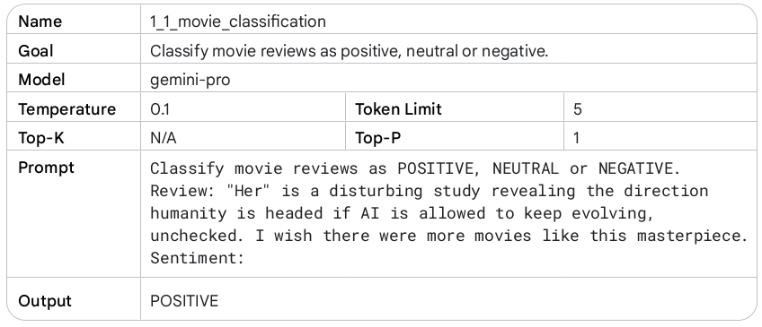

### One-shot & few-shot

- Examples are especially useful when you want to steer the model to a certain output structure or pattern.

- one-shot prompt provides a single example

- few-shot prompt provides multiple examples, increases the chance the model follows an specific pattern, general rule: 3 to 5 examples

- number of examples depends on:
  - complexity of the task
  - quality of the examples
  - capabilities of the model

- If you are trying to generate output that is robust to a variety of inputs, then it is important to include edge cases in your examples. Edge cases are inputs that are unusual or unexpected, but that the model should still be able to handle.

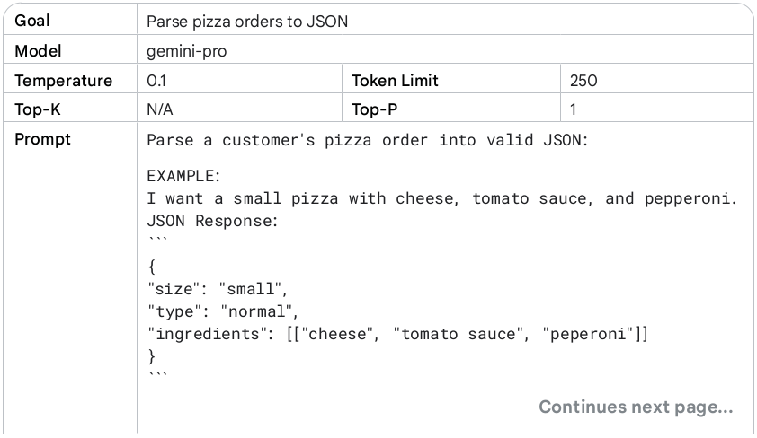

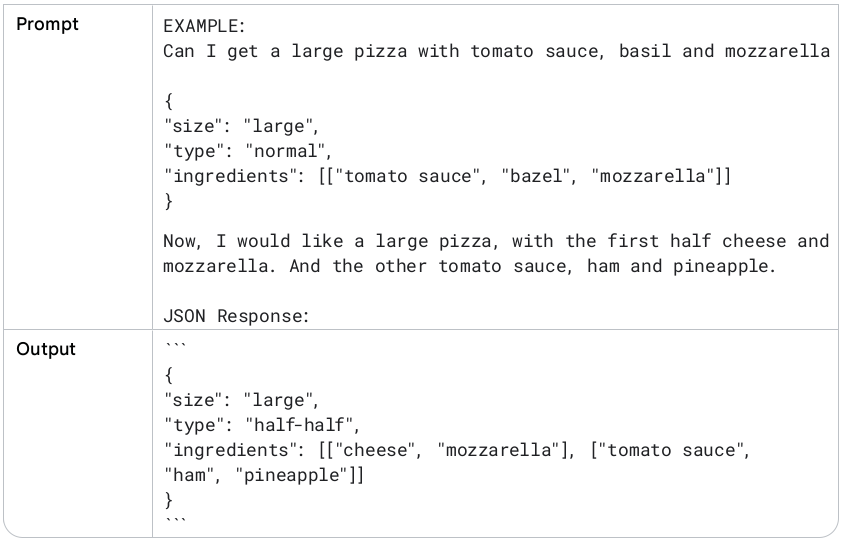

### System, contextual and role prompting

- **System prompting** sets the overall context and purpose for the language model. It defines the ‘big picture’ of what the model should be doing, like translating a language, classifying a review etc.

- **Contextual prompting** provides specific details or background information relevant to the current conversation or task. It helps the model to understand the nuances of what’s being asked and tailor the response accordingly.

- **Role prompting** assigns a specific character or identity for the language model to adopt. This helps the model generate responses that are consistent with the assigned role and its associated knowledge and behavior.

- **System prompt**: Defines the model’s fundamental capabilities and overarching purpose.

- System prompts can be useful for generating output that meets specific requirements. The name ‘system prompt’ actually stands for ‘providing an additional task to the system’. For example, you could use a system prompt to generate a code snippet that is compatible with a specific programming language, or you could use a system prompt to return a certain structure.

- System prompts can also be really useful for safety and toxicity. To control the output, simply add an additional line to your prompt like: ‘You should be respectful in your answer.’.

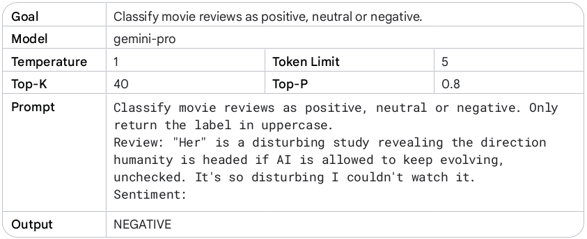

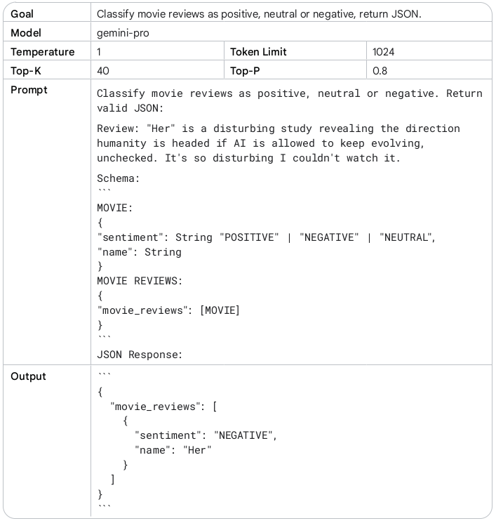

- **Contextual prompt**: Provides immediate, task-specific information to guide the response. It’s highly specific to the current task or input, which is dynamic.

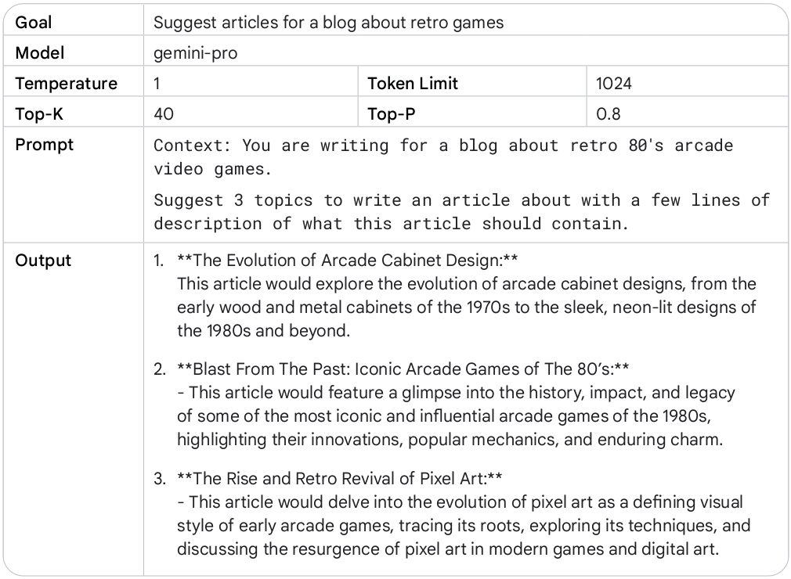

- **Role prompt**: Frames the model’s output style and voice. It adds a layer of specificity and personality.

- For example, you could role prompt a gen AI model to be a book editor, a kindergarten teacher, or a motivational speaker. Once the model has been assigned a role, you can then give it prompts that are specific to that role. For example, you could prompt a teacher to create a lesson plan that they can then review.

- Defining a role perspective for an AI model gives it a blueprint of the tone, style, and focused expertise you’re looking for to improve the quality, relevance, and effectiveness of your output.


- role styles:
  Confrontational, Descriptive, Direct, Formal, Humorous, Influential, Informal,
  Inspirational, Persuasive

- Distinguishing between system, contextual, and role prompts provides a framework for designing prompts with clear intent, allowing for flexible combinations and making it easier to analyze how each prompt type influences the language model’s output.

### Step-back prompting

- Step-back prompting is a technique for improving the performance by prompting the LLM to first consider a general question related to the specific task at hand, and then feeding the answer to that general question into a subsequent prompt for the specific task. This ‘step back’ allows the LLM to activate relevant background knowledge and reasoning processes before attempting to solve the specific problem.

- Step-back prompting encourages LLMs to think critically and apply their knowledge in new and creative ways. It can help to mitigate biases in LLM responses, by focusing on general principles instead of specific details, step-back prompting.

- Traditional prompt vs Step-back prompt

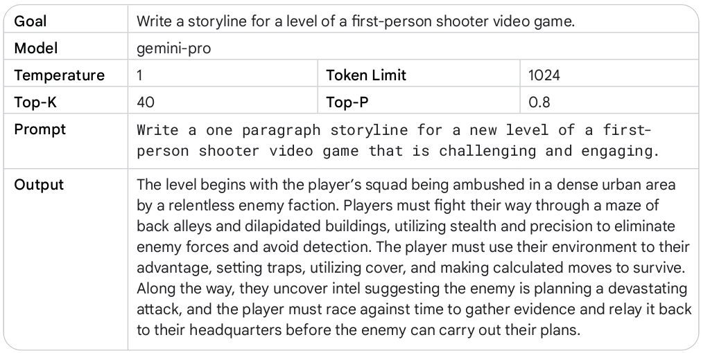

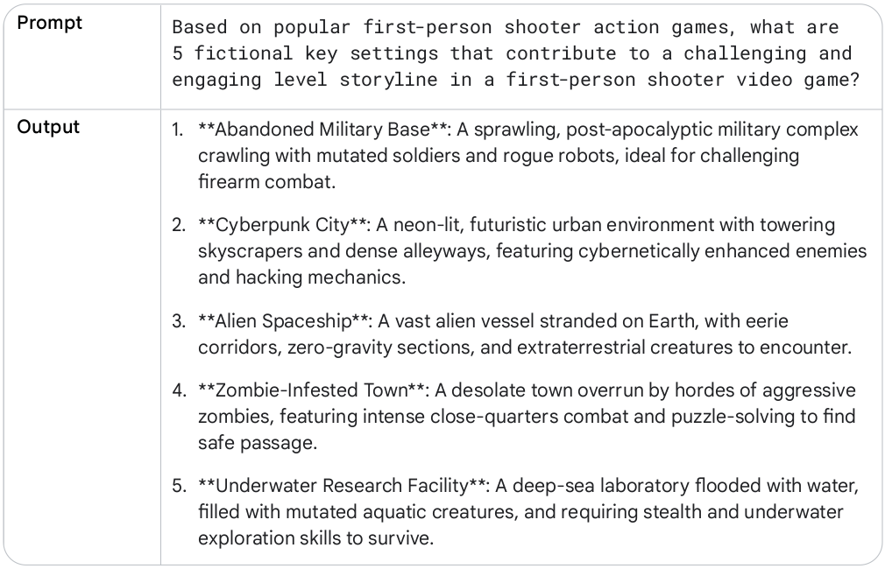

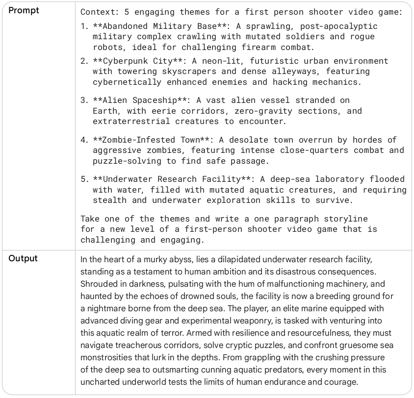

### Chain of Thought (CoT)

- Chain of Thought (CoT) prompting is a technique for improving the reasoning capabilities of LLMs by generating intermediate reasoning steps. This helps the LLM generate more accurate answers. You can combine it with few-shot prompting to get better results on more complex tasks that require reasoning before responding as it’s a challenge with a zero-shot chain of thought. (step-by-step solving)

- the model can be prompted to generate reasoning steps like a human solving a problem.

- For CoT prompting, set the temperature to 0. Chain of thought prompting is based on greedy decoding, predicting the next word in a sequence based on the highest probability assigned by the language model. Generally speaking, when using reasoning, to come up with the final answer, there’s likely one single correct answer. Therefore the temperature should always set to 0.

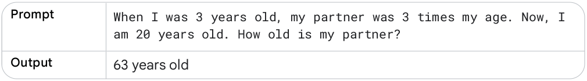

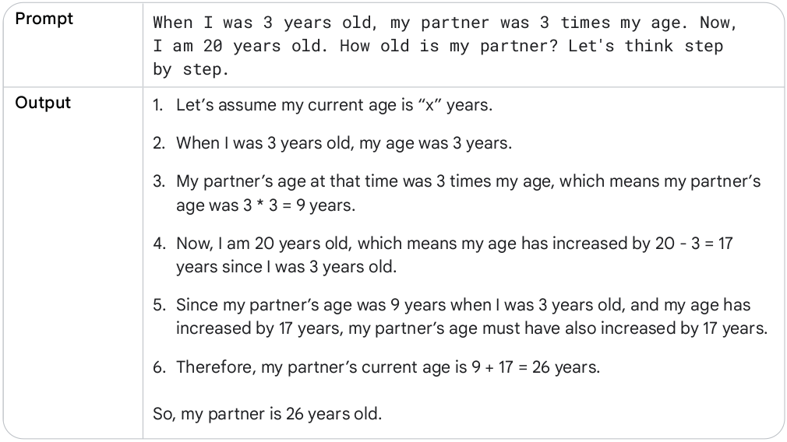

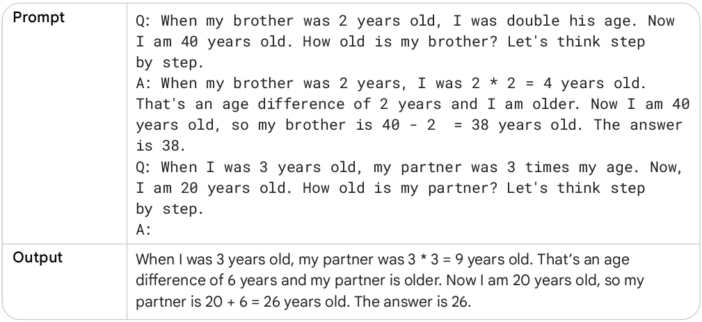

### Self-consistency

- CoT uses a simple ‘greedy decoding’ strategy, limiting its effectiveness. Self-consistency combines sampling and majority voting to generate diverse reasoning paths and select the most consistent answer. It improves the accuracy and coherence of responses generated by LLMs.

- Self-consistency gives a pseudo-probability likelihood of an answer being correct, but obviously has high costs. It follows the following steps:
  1. Generating diverse reasoning paths: The LLM is provided with the same prompt multiple times. A high temperature setting encourages the model to generate different reasoning paths and perspectives on the problem.

  2. Extract the answer from each generated response.

  3. Choose the most common answer.


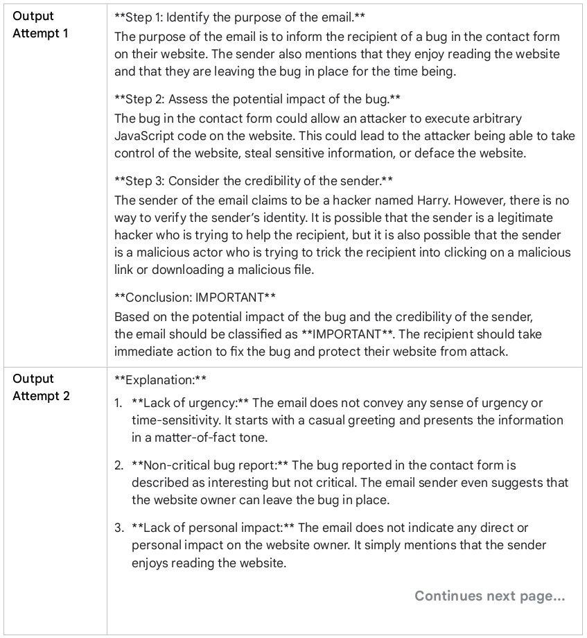

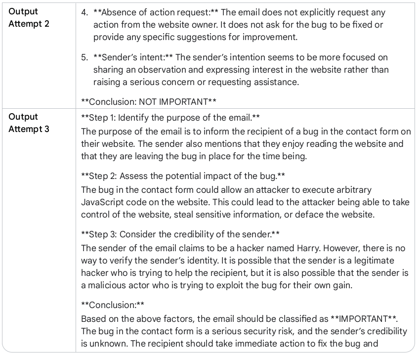

- This example shows how self-consistency prompting can be used to improve the accuracy of an LLM’s response by considering multiple perspectives and selecting the most consistent answer.

### Tree of Thoughts (ToT)

- It generalizes the concept of CoT prompting because it allows LLMs to explore multiple different reasoning paths simultaneously, rather than just following a single linear chain of thought.

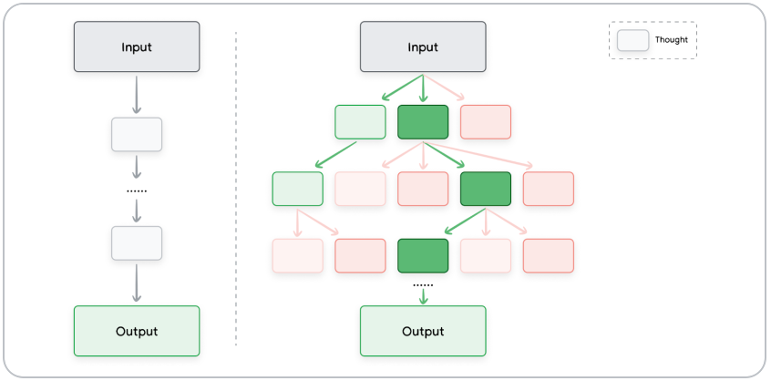

- This approach makes ToT particularly well-suited for complex tasks that require exploration. It works by maintaining a tree of thoughts, where each thought represents a coherent language sequence that serves as an intermediate step toward solving a problem. The model can then explore different reasoning paths by branching out from different nodes in the tree.

### ReAct (reason & act)

- ReAct prompting is a paradigm for enabling LLMs to solve complex tasks using natural language reasoning combined with external tools (search, code interpreter etc.) allowing the LLM to perform certain actions, such as interacting with external APIs to retrieve information which is a first step towards agent modeling.

- ReAct mimics how humans operate in the real world, as we reason verbally and can take actions to gain information.

- ReAct prompting works by combining reasoning and acting into a thought-action loop. The LLM first reasons about the problem and generates a plan of action. It then performs the actions in the plan and observes the results. The LLM then uses the observations to update its reasoning and generate a new plan of action. This process continues until the LLM reaches a solution to the problem.

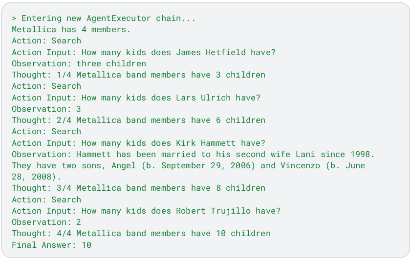

### Automatic Prompt Engineering (APE)

- You will prompt a model to generate more prompts. Evaluate them, possibly alter the good ones. And repeat.

- Multimodal prompting: a technique where you use multiple input formats to guide a large language model, instead of just relying on text. This can include combinations of text, images, audio, code, or even other formats, depending on the model’s capabilities and the task at hand.

## Best Practices

1. **Provide examples**

2. **Design with simplicity**: Prompts should be concise, clear, and easy to understand for both you and the model.

- Try using verbs that describe the action. Here’s a set of examples: Act, Analyze, Categorize, Classify, Contrast, Compare, Create, Describe, Define, Evaluate, Extract, Find, Generate, Identify, List, Measure, Organize, Parse, Pick, Predict, Provide, Rank, Recommend, Return, Retrieve, Rewrite, Select, Show, Sort, Summarize, Translate, Write.

3. **Be specific about the output**

4. **Use Instructions over Constraints**

- An instruction provides explicit instructions on the desired format, style, or content of the response. It guides the model on what the model should do or produce.

- A constraint is a set of limitations or boundaries on the response. It limits what the model should not do or avoid.

- If possible, use positive instructions: instead of telling the model what not to do, tell it what to do instead. This can avoid confusion and improve the accuracy of the output.

- Only use constraints when necessary for safety, clarity or specific requirements.

5. **Control the max token length**

6. **Use variables in prompts**

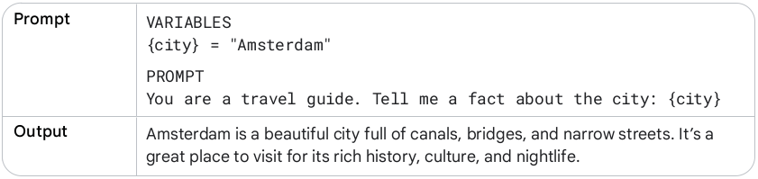

7. **Experiment with input formats and writing styles**

8. **For few-shot prompting with classification tasks, mix up the classes**

- Generally speaking, the order of your few-shots examples should not matter much. However, when doing classification tasks, make sure you mix up the possible response classes in the few shot examples. This is because you might otherwise be overfitting to the specific order of the examples. By mixing up the possible response classes, you can ensure that the model is learning to identify the key features of each class, rather than simply memorizing the order of the examples.

9. **Adapt to model updates and Try out newer model versions**

10. **Experiment with output formats**

- For non-creative tasks like extracting, selecting, parsing, ordering, ranking, or categorizing data try having your output returned in a structured format like JSON or XML.

- The structured nature of JSON, while beneficial for parsing and use in applications, requires significantly more tokens than plain text, leading to increased processing time and higher costs. Furthermore, JSON's verbosity can easily consume the entire output window, becoming especially problematic when the generation is abruptly cut off due to token limits. This truncation often results in invalid JSON, missing crucial closing braces or brackets, rendering the output unusable. (use json-repair lib)

- A JSON Schema defines the expected structure and data types of your JSON input. By providing a schema, you give the LLM a clear blueprint of the data it should expect, helping it focus its attention on the relevant information and reducing the risk of misinterpreting the input.

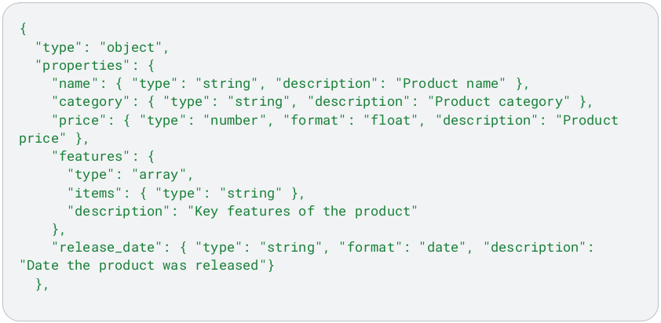

11. **Document the various prompt attempts**: document your prompt attempts in full detail so you can learn over time what went well and what did not.

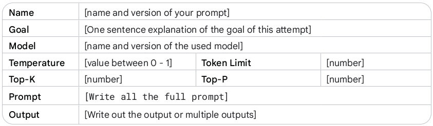

## Decision-Making Prompts: Compare & Decide (Compare multiple options with structured analysis)

- Don't ask AI for a single soultion, use AI strategically to compare and evaluate different options -> instead of a generic one-size-fits-all response, AI thinks through multiple angles and gives you a structured comparison.


## Persona-Based Prompts: Expert Thinking (Make AI think like an industry expert)

- Instruct AI to adopt a specific expert role -> AI generates responses from that expert's viewpoint -> receive higher quality, industry-specific output -> works across any industry or expertise

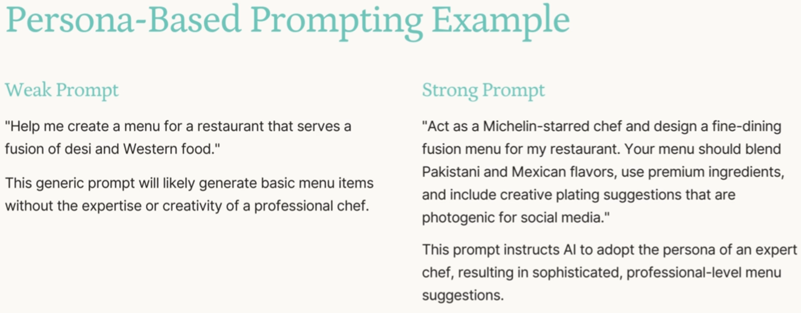

## Flipped Interaction Technique: Questions Before Answers (Have AI ask clarifying questions first)

1. Identify the problem

2. Flip the interaction: Ask AI to ask you clarifying questions before generating a response

3. Provide detailed answers: Respond to AI's questions with specific information about your needs

4. Receive tailored results

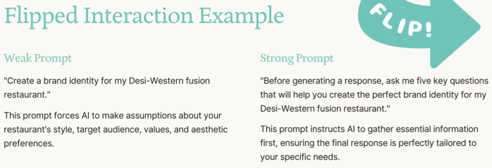

- perfect for complex task where you're still figuraing out the details. instead of blindly assuming things, it pauses to gather the inforation it needs to generate a truly helpful response

## Prompt Refinement Technique: AI Improving Your Prompts (Use AI to improve your prompts)

- If you are not sure how to phrase a request or what details to include -> you can literally ask AI to refine your prompt for better clarity


## Alternative Approach Patterns: Multiple Solutions (Generate multiple strategic solutions)

1. Ask AI to generate several different approaches to solving your problem

2. Explore diverse solutions you might not have considered

3. Choose from multiple strategies rather than being limited to one

4. See different approches side by side to identify the best fit

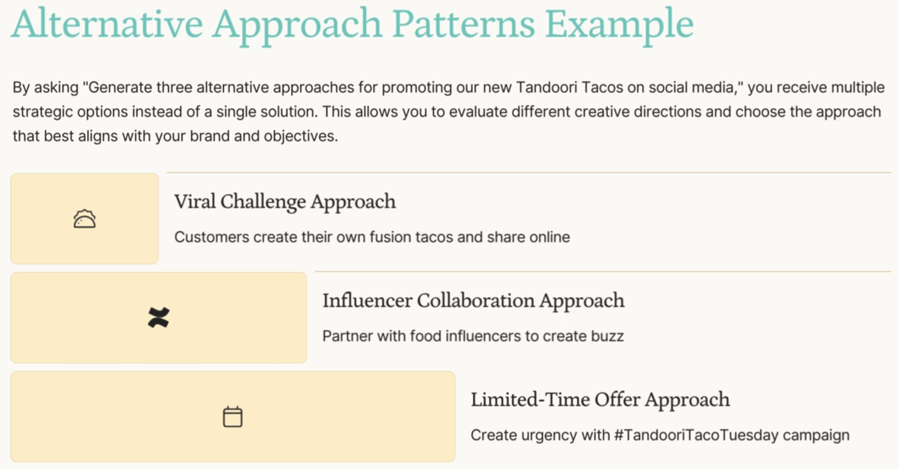

- perfect for brainstorming and exploring creative solutions

## Question Refinement Technique: Asking Better Questions (Sharpen your questions before answering)

1. Identify vague questions

2. Request question improvement: Ask AI to reframe your question before answering it

3. Get a more specific, actionable version of your orifinal question

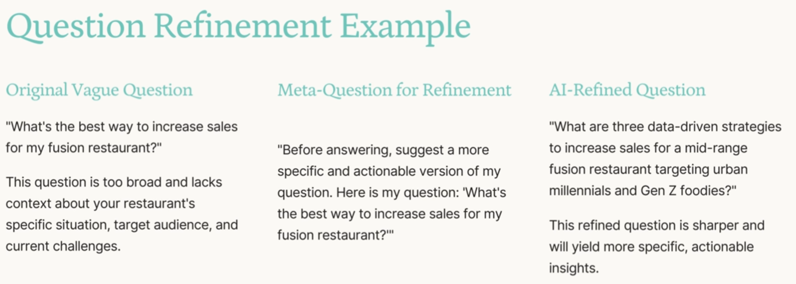

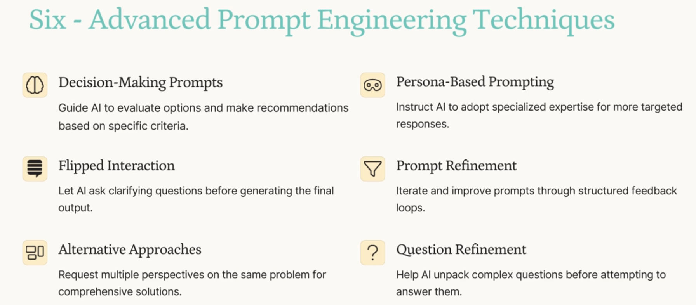

## Agent Prompt Template Example

```
## Agent Role
You are a **[Role]** that assists users with **[specific task]**. Your goal is to complete the task accurately, efiiciently, and safely.

## Process
1. **Identify the task** and categorize it: [A], [B], or [Other]
2. **Category A**: Follow [specific steps].
3. **Category B**: Use [alternative steps].
4. **Other or unclear**: Ask for clarification or escalate.

## Constraints
- **Never** provife unsupported or sensitive advice.
- **Always** use approved tools and verify before acting.

## Guidelines
- Be clear, helpful, and polite.
- Ask questions if context is missing.
```

## Conclusion

- Prompt engineering is an iterative process. Craft and test different prompts, analyze, and document the results. Refine your prompt based on the model’s performance. Keep experimenting until you achieve the desired output. When you change a model or model configuration, go back and keep experimenting with the previously used prompts.

## Resources

- Google_prompt_engineering**Lee_Boonstra**Februaray_2025\*

- The Ultimate Prompt Engineering Crash Course for Sucess. (Udemy)
